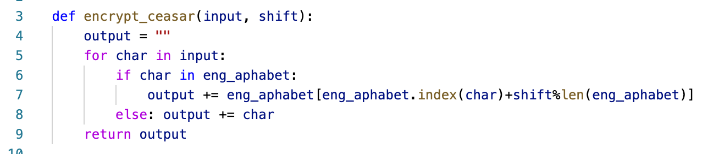
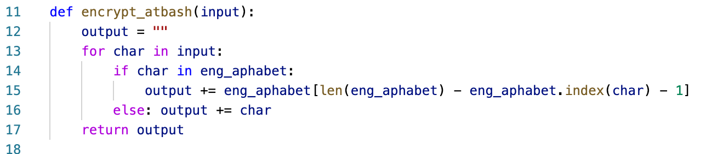
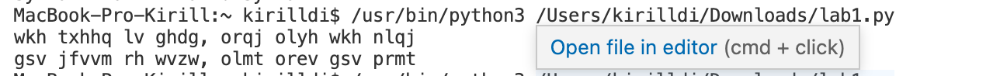

---
## Front matter
lang: ru-RU
title: Защита лабораторной номер 1
subtitle: по предмету мат. основы защиты информации
author:
  - Дидусь К.В.
institute:
  - Российский университет дружбы народов, Москва, Россия

## i18n babel
babel-lang: russian
babel-otherlangs: english

## Formatting pdf
toc: false
toc-title: Содержание
slide_level: 2
aspectratio: 169
section-titles: true
theme: metropolis
header-includes:
 - \metroset{progressbar=frametitle,sectionpage=progressbar,numbering=fraction}
 - '\makeatletter'
 - '\beamer@ignorenonframefalse'
 - '\makeatother'
---

# Вводная часть

## Актуальность

- Изучение базовых принципов шифрования
- Важность знания основ шифрования для работы в сфере информационных технологий

## Объект и предмет исследования

- Шифры простой замены
  - Шифр Цезаря
  - Шифр Атбаш

## Цели и задачи

- Ознакомиться с шифрами простой замены 
- Реализовать шифры на любом языке программирования

## Материалы и методы

- Национальный Открытый Университет "ИНТУИТ"
- Язык программирования Python

# Выполнение лабораторной работы

## Шифр Цезаря

{width="40%"}

## Шифр Атбаш

{width="40%"}

## Вывод

{width="80%"}

# Результаты

## Результаты

::: incremental

- Ознакомился с шифрами простой замены: шифр Цезаря, шифр Атбаш
- Программно реализовал шифры с помощью языка программирования Python

:::
