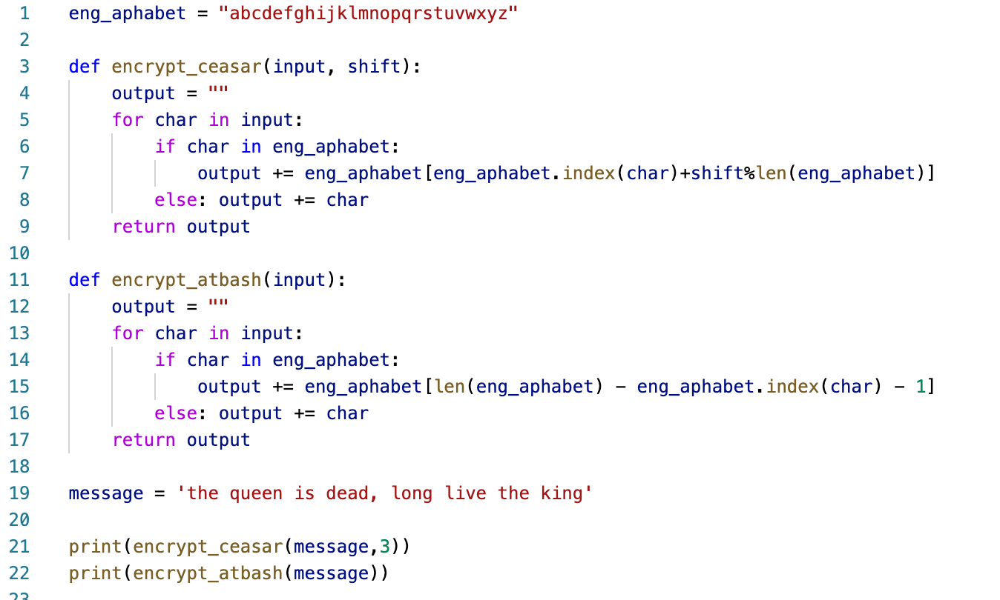
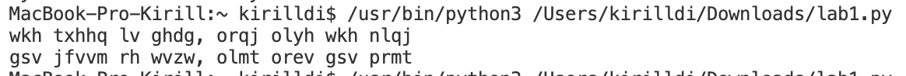

---
## Front matter
title: "Отчет по лабораторной работе 1"
subtitle: "По предмету мат. основы защиты информации"
author: "Дидусь Кирилл Валерьевич"

## Generic otions
lang: ru-RU
toc-title: "Содержание"

## Bibliography
bibliography: bib/cite.bib
csl: pandoc/csl/gost-r-7-0-5-2008-numeric.csl

## Pdf output format
toc: true # Table of contents
toc-depth: 2
lof: true # List of figures
lot: true # List of tables
fontsize: 12pt
linestretch: 1.5
papersize: a4
documentclass: scrreprt
## I18n polyglossia
polyglossia-lang:
  name: russian
  options:
	- spelling=modern
	- babelshorthands=true
polyglossia-otherlangs:
  name: english
## I18n babel
babel-lang: russian
babel-otherlangs: english
## Fonts
mainfont: PT Serif
romanfont: PT Serif
sansfont: PT Sans
monofont: PT Mono
mainfontoptions: Ligatures=TeX
romanfontoptions: Ligatures=TeX
sansfontoptions: Ligatures=TeX,Scale=MatchLowercase
monofontoptions: Scale=MatchLowercase,Scale=0.9
## Biblatex
biblatex: true
biblio-style: "gost-numeric"
biblatexoptions:
  - parentracker=true
  - backend=biber
  - hyperref=auto
  - language=auto
  - autolang=other*
  - citestyle=gost-numeric
## Pandoc-crossref LaTeX customization
figureTitle: "Рис."
tableTitle: "Таблица"
listingTitle: "Листинг"
lofTitle: "Список иллюстраций"
lotTitle: "Список таблиц"
lolTitle: "Листинги"
## Misc options
indent: true
header-includes:
  - \usepackage{indentfirst}
  - \usepackage{float} # keep figures where there are in the text
  - \floatplacement{figure}{H} # keep figures where there are in the text
---

# Цель работы

- Изучить простейшие методы шифрования
- Рассмотреть функционирование шифров простой замены

# Задание
- Реализовать шиф Цезаря с произвольным ключом k
- Реализовать шифр Атбаш

# Теоретическое введение
- Атба́ш (ивр. ‏אתבש‏‎) — простой шифр подстановки для алфавитного письма. Правило шифрования состоит в замене i-й буквы алфавита буквой с номером n−i+1 {\displaystyle n-i+1}, где n — число букв в алфавите. Впервые встречается в древнееврейском тексте Библии / Танаха. 

- Шифр Цезаря — это вид шифра подстановки, в котором каждый символ в открытом тексте заменяется символом, находящимся на некотором постоянном числе позиций левее или правее него в алфавите. Например, в шифре со сдвигом вправо на 3, А была бы заменена на Г, Б станет Д, и так далее. Шифр назван в честь римского полководца Гая Юлия Цезаря, использовавшего его для секретной переписки со своими генералами.

# Выполнение лабораторной работы

Выполнил программную реализацию шифров простой замены. Реализация выполнена в среде разработки Visial Studio Code на языке python (рис.1 [-@fig:001])

{ #fig:001 width=70% }

Сообщение 'the queen is dead, long live the king' было закодирована двумя шифрами. Зашифрованное сообщение представлено на рисунке (рис.2 [-@fig:002])

{ #fig:001 width=70% }

# Выводы

Изучил реализацию шифров простой замены

# Список литературы{.unnumbered}

::: {#refs}
:::
