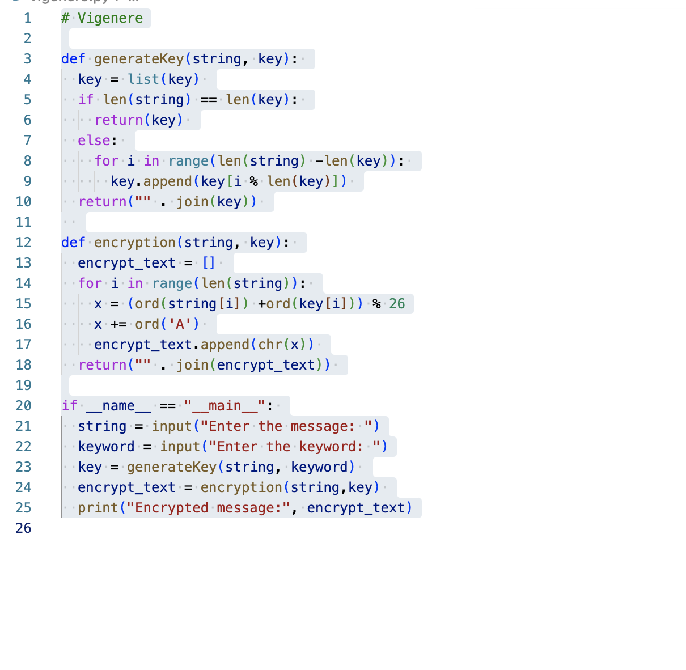
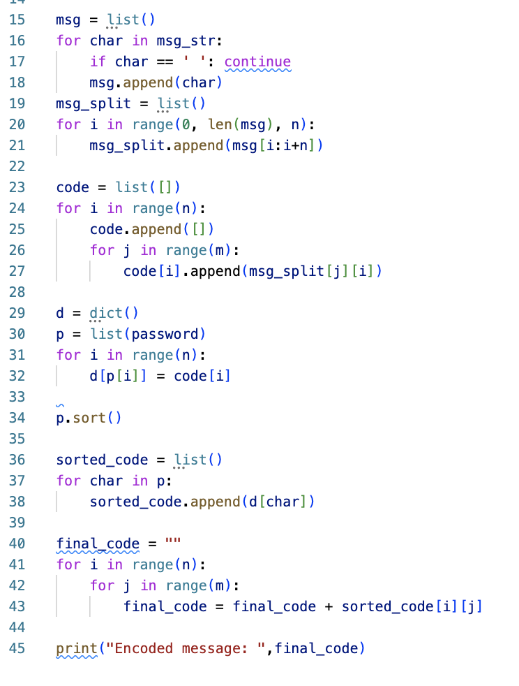
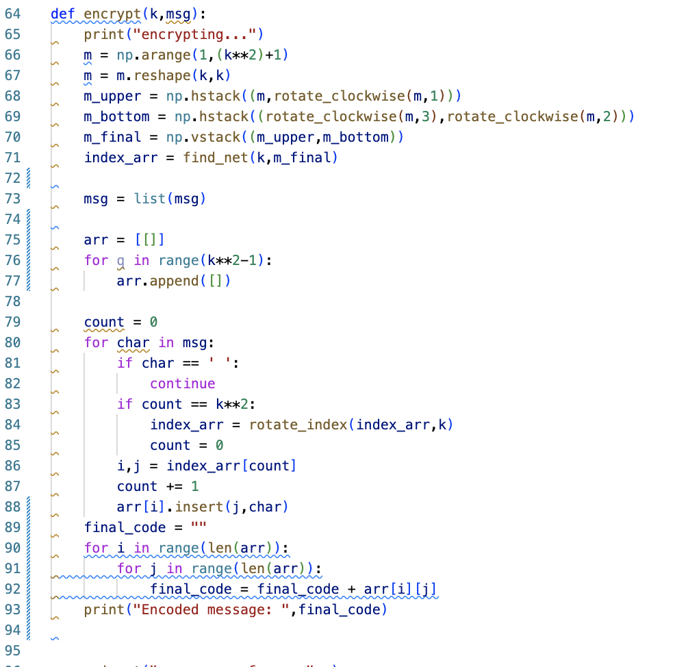

---
## Front matter
title: "Отчет по лабораторной работе номер 2"
subtitle: "По предмету мат. основы защиты информации"
author: "Дидусь Кирилл Валерьевич"

## Generic otions
lang: ru-RU
toc-title: "Содержание"

## Bibliography
bibliography: bib/cite.bib
csl: pandoc/csl/gost-r-7-0-5-2008-numeric.csl

## Pdf output format
toc: true # Table of contents
toc-depth: 2
lof: true # List of figures
lot: true # List of tables
fontsize: 12pt
linestretch: 1.5
papersize: a4
documentclass: scrreprt
## I18n polyglossia
polyglossia-lang:
  name: russian
  options:
	- spelling=modern
	- babelshorthands=true
polyglossia-otherlangs:
  name: english
## I18n babel
babel-lang: russian
babel-otherlangs: english
## Fonts
mainfont: PT Serif
romanfont: PT Serif
sansfont: PT Sans
monofont: PT Mono
mainfontoptions: Ligatures=TeX
romanfontoptions: Ligatures=TeX
sansfontoptions: Ligatures=TeX,Scale=MatchLowercase
monofontoptions: Scale=MatchLowercase,Scale=0.9
## Biblatex
biblatex: true
biblio-style: "gost-numeric"
biblatexoptions:
  - parentracker=true
  - backend=biber
  - hyperref=auto
  - language=auto
  - autolang=other*
  - citestyle=gost-numeric
## Pandoc-crossref LaTeX customization
figureTitle: "Рис."
tableTitle: "Таблица"
listingTitle: "Листинг"
lofTitle: "Список иллюстраций"
lotTitle: "Список таблиц"
lolTitle: "Листинги"
## Misc options
indent: true
header-includes:
  - \usepackage{indentfirst}
  - \usepackage{float} # keep figures where there are in the text
  - \floatplacement{figure}{H} # keep figures where there are in the text
---

# Цель работы

- Изучение шрифров перестановки

# Задание

- Программно реализовать шифр виженера
- Программно реализовать шифр вертикальной перестановки

# Теоретическое введение

Шифр перестано́вки — это метод симметричного шифрования, в котором элементы исходного открытого текста меняют местами. Элементами текста могут быть отдельные символы (самый распространённый случай), пары букв, тройки букв, комбинирование этих случаев и так далее. Типичными примерами перестановки являются анаграммы. В классической криптографии шифры перестановки можно разделить на два класса:

- Шифры одинарной (простой) перестановки — при шифровании символы открытого текста перемещаются с исходных позиций в новые один раз.
- Шифры множественной (сложной) перестановки — при шифровании символы открытого текста перемещаются с исходных позиций в новые несколько раз.

Широкое распространение получила разновидность маршрутной перестановки — вертикальная перестановка. В этом шифре также используется прямоугольная таблица, в которую сообщение записывается по строкам слева направо. Выписывается шифрограмма по вертикалям, при этом столбцы выбираются в порядке, определяемом ключом.

Шифр Виженера (фр. Chiffre de Vigenère) — метод полиалфавитного шифрования буквенного текста с использованием ключевого слова.

Этот метод является простой формой многоалфавитной замены. Шифр Виженера изобретался многократно. Впервые этот метод описал Джовани Баттиста Белласо (итал. Giovan Battista Bellaso) в книге La cifra del. Sig. Giovan Battista Bellasо в 1553 году, однако в XIX веке получил имя Блеза Виженера, французского дипломата. Метод прост для понимания и реализации, но является недоступным для простых методов криптоанализа.

Хотя шифр легко понять и реализовать, на протяжении трех столетий он противостоял всем попыткам его сломать; чем и заработал имя le chiffre indéchiffrable (фр. неразгаданный шифр). Многие люди пытались реализовать схемы шифрования, которые по сути являлись шифрами Виженера.

# Выполнение лабораторной работы

Был разработ код для программной реализации шифров из теории лабораторной работы. 

1. Шифр Виженера (рис. [-@fig:001])

{ #fig:001 width=70% }

2. Шифр вертикальлной перестановки (рис. [-@fig:002])

{ #fig:002 width=70% }

2. Шифрование с помощью решеток (рис. [-@fig:003])

{ #fig:003 width=70% }


# Выводы

Мы изучили  шифры перестановки.

# Листинг программ

## шифр Виженера

``` python
# Vigenere

def generateKey(string, key): 
  key = list(key) 
  if len(string) == len(key): 
    return(key) 
  else: 
    for i in range(len(string) -len(key)): 
      key.append(key[i % len(key)]) 
  return("" . join(key)) 
  
def encryption(string, key): 
  encrypt_text = [] 
  for i in range(len(string)): 
    x = (ord(string[i]) +ord(key[i])) % 26
    x += ord('A') 
    encrypt_text.append(chr(x)) 
  return("" . join(encrypt_text)) 

if __name__ == "__main__": 
  string = input("Enter the message: ")
  keyword = input("Enter the keyword: ")
  key = generateKey(string, keyword) 
  encrypt_text = encryption(string,key) 
  print("Encrypted message:", encrypt_text)

```
## шифрование с помощью решеток

``` python
from distutils.file_util import move_file
from email import message
from operator import index
import numpy as np
import random

# Function to rotate the matrix
#  degree clockwise
from contextlib import nullcontext


def rotate_clockwise(M,n):
	#print("starting rotate_clockwise...")
	m_r = M.copy()
	for i in range(0,n):
		N = len(m_r[0])
		for i in range(N // 2):
			for j in range(i, N - i - 1):
				temp = m_r[i][j]
				m_r[i][j] = m_r[N - 1 - j][i]
				m_r[N - 1 - j][i] = m_r[N - 1 - i][N - 1 - j]
				m_r[N - 1 - i][N - 1 - j] = m_r[j][N - 1 - i]
				m_r[j][N - 1 - i] = temp
	return m_r

def find_net(k,m):
	#print("starting find_net...")
	m_net = m.copy()
	rand_index = random.randint(0,3)
	index_arr = np.array([],dtype=np.int64)
	for n in range(1,k**2+1):
		flag = 0
		occurance = 0
		for i in range(len(m_net[0])):
			for j in range(len(m_net[0])):
				if (m_net[i,j] == n):
					if (occurance == rand_index):
						index_arr = np.append([i,j],index_arr)
						flag = 1
						break
					occurance +=1
			if flag == 1:
				break
	index_arr = index_arr.reshape(k**2,2)
	index_arr = index_arr[np.lexsort(index_arr.T[::-1])]
	return index_arr

def rotate_index(index_arr,k):
	#print("starting rotate_index...")
	arr = index_arr.copy()
	arr = (np.flip(arr))
	new_index = np.array([],dtype=np.int64)
	N = k**2
	for n in range(k**2):
		j,i = arr[n]
		temp = i
		i = j
		j = N - temp - 1
		new_index = np.append(new_index,[i,j])
	new_index = new_index.reshape(k**2,2)
	new_index = new_index[np.lexsort(new_index.T[::-1])]
	return new_index

def encrypt(k,msg):
	print("encrypting...")
	m = np.arange(1,(k**2)+1)
	m = m.reshape(k,k)
	m_upper = np.hstack((m,rotate_clockwise(m,1)))
	m_bottom = np.hstack((rotate_clockwise(m,3),rotate_clockwise(m,2)))
	m_final = np.vstack((m_upper,m_bottom))
	index_arr = find_net(k,m_final)
	
	msg = list(msg)
	
	arr = [[]]
	for q in range(k**2-1):
		arr.append([])

	count = 0
	for char in msg:
		if char == ' ':
			continue
		if count == k**2:
			index_arr = rotate_index(index_arr,k)
			count = 0
		i,j = index_arr[count]
		count += 1
		arr[i].insert(j,char)
	final_code = ""
	for i in range(len(arr)):
		for j in range(len(arr)):
			final_code = final_code + arr[i][j]
	print("Encoded message: ",final_code)
		

msg = input("введите сообщение:", )
size = 2
count = 0
for char in msg:
		if char == ' ':
			continue
		count+=1
while(count > ((2*size)*(2*size))):
	size+=1

encrypt(size,msg)	
```
## шифр вертикальной перестановки
``` Python

from numpy import sort


msg_str = "договор подписали"
m = 4 #кол-во блоков
n = 4 # длина блоков
password = "шифр"
def get_input():
    msg_str = input("введите сообщение:", )
    m = input("введите кол-во блоков:",)
    n = input("введите длину блоков:",)
    return(msg_str,m,n)

msg = list()
for char in msg_str:
    if char == ' ': continue
    msg.append(char)
msg_split = list()
for i in range(0, len(msg), n):
    msg_split.append(msg[i:i+n])

code = list([])
for i in range(n):
    code.append([])
    for j in range(m):
        code[i].append(msg_split[j][i])

d = dict()
p = list(password)
for i in range(n):
    d[p[i]] = code[i]
    
p.sort()

sorted_code = list()
for char in p:
    sorted_code.append(d[char])

final_code = ""
for i in range(n):
    for j in range(m):
        final_code = final_code + sorted_code[i][j]

print("Encoded message: ",final_code)
```
# Список литературы{.unnumbered}

- ТУИС РУДН
- Википедия

::: {#refs}
:::
