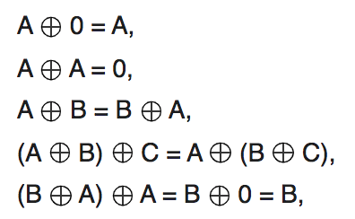
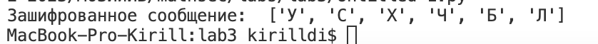

---
## Front matter
title: "Отчет по лабораторной работе 3"
subtitle: "По предмету мат. основы защиты информации"
author: 
- "Студент: Дидусь Кирилл Валерьевич, 1132223499"
- "Группа: НПМмд-02-22"
- "Преподаватель: Кулябов Дмитрий Сергеевич,"
- "д-р.ф.-м.н., проф."
date: "Москва, 2022"

## Generic otions
lang: ru-RU
toc-title: "Содержание"

## Bibliography
bibliography: bib/cite.bib
csl: pandoc/csl/gost-r-7-0-5-2008-numeric.csl

## Pdf output format
toc: true # Table of contents
toc-depth: 2
lof: true # List of figures
lot: true # List of tables
fontsize: 12pt
linestretch: 1.5
papersize: a4
documentclass: scrreprt
## I18n polyglossia
polyglossia-lang:
  name: russian
  options:
	- spelling=modern
	- babelshorthands=true
polyglossia-otherlangs:
  name: english
## I18n babel
babel-lang: russian
babel-otherlangs: english
## Fonts
mainfont: PT Serif
romanfont: PT Serif
sansfont: PT Sans
monofont: PT Mono
mainfontoptions: Ligatures=TeX
romanfontoptions: Ligatures=TeX
sansfontoptions: Ligatures=TeX,Scale=MatchLowercase
monofontoptions: Scale=MatchLowercase,Scale=0.9
## Biblatex
biblatex: true
biblio-style: "gost-numeric"
biblatexoptions:
  - parentracker=true
  - backend=biber
  - hyperref=auto
  - language=auto
  - autolang=other*
  - citestyle=gost-numeric
## Pandoc-crossref LaTeX customization
figureTitle: "Рис."
tableTitle: "Таблица"
listingTitle: "Листинг"
lofTitle: "Список иллюстраций"
lotTitle: "Список таблиц"
lolTitle: "Листинги"
## Misc options
indent: true
header-includes:
  - \usepackage{indentfirst}
  - \usepackage{float} # keep figures where there are in the text
  - \floatplacement{figure}{H} # keep figures where there are in the text
---

# Цель работы

Целью данной лабораторной работы является ознакомление с шифрованием гаммированием, а так же реализация шифрования гаммирования конечной гаммой.

# Задание

Реализовать алгоритм шифрования гаммированием конечной гаммой.

# Теоретическое введение

**Гаммирование, или Шифр XOR**, — метод симметричного шифрования, заключающийся в «наложении» последовательности, состоящей из случайных чисел, на открытый текст. Последовательность случайных чисел называется гамма-последовательностью и используется для зашифровывания и расшифровывания данных. Суммирование обычно выполняется в каком-либо конечном поле. Например, в поле Галуа суммирование принимает вид операции «исключающее ИЛИ (XOR)» [1].

В криптографии простой шифр XOR является разновидностью аддитивного шифра, алгоритма шифрования, который работает в соответствии с принципами [2]:

   { #fig:001 width=60% }

где $\oplus$ обозначает операцию исключающей дизъюнкции (XOR). Эта операция иногда называется сложением по модулю 2 (или вычитанием, что идентично). С помощью данной логики строка текста может быть зашифрована путем применения побитового оператора XOR к каждому символу с использованием заданного ключа. Для расшифровки результата достаточно повторно применить функцию XOR с ключом, чтобы снять шифр [2].

**Шифры гаммирования** (аддитивные шифры) являются самыми эффективными с точки зрения стойкости и скорости преобразований (процедур зашифрования и дешифрования). По стойкости данные шифры относятся к классу совершенных. Для зашифрования и дешифрования используются элементарные арифметические операции – открытое/зашифрованное сообщение и гамма, представленные в числовом виде, складываются друг с другом по модулю (mod) [3].

Пусть символам исходного алфавита соответствуют числа от 0 (А) до 32 (Я). Если обозначить число, соответствующее исходному символу, x, а символу ключа – k, то можно записать правило гаммирования следующим образом: z = x + k (mod N), где z – закодированный символ, N - количество символов в алфавите, а сложение по модулю N - операция, аналогичная обычному сложению, с тем отличием, что если обычное суммирование дает результат, больший или равный N, то значением суммы считается остаток от деления его на N [4].

# Выполнение лабораторной работы

**Примечание:** комментарии по коду представлены на скриншотах к каждому из проделанных заданий.

## Шифрование гаммированием

В соответствии с заданием, была написана программа для шифрования гаммированием. Программный код представлен в качестве листинга в конце отчета.

   { #fig:002 width=60% }

# Библиоиграфия

1. Википедия. Гаммирование [Электронный ресурс]. Википедия, свободная энциклопедия, 2022. URL: <https://ru.wikipedia.org/wiki/%D0%93%D0%B0%D0%BC%D0%BC%D0%B8%D1%80%D0%BE%D0%B2%D0%B0%D0%BD%D0%B8%D0%B5> (дата обращения: 14.11.2022).

2. Wikipedia. XOR cipher [Электронный ресурс]. Wikipedia, free Encyclopedia, 2022. URL: <https://en.wikipedia.org/wiki/XOR_cipher> (дата обращения: 14.11.2022).

3. Викторович А.В. 6.1 Шифры гаммирования [Электронный ресурс].Учебная и научная деятельность Анисимова Владимира Викторовича, 2021. URL: <https://www.sites.google.com/site/anisimovkhv/learning/kripto/lecture/tema6> (дата обращения: 14.11.2022).

4. Интерактивная система обучения. Методы шифрования с закрытым ключом [Электронный ресурс]. Электроника для всех, 2017. URL: <https://emkelektron.webnode.com/news/metody-shifrovaniya-zamenoj-podstanovkoj/> (дата обращения: 14.11.2022).

# Выводы

Таким образом, была достигнута цель, поставленная в начале лабораторной работы: я ознакомился с шифрованием гаммированием, а так же мне удалось реализовать алгоритм шифрования конечной гаммой на языке программирования Python.

# Листинг программы

``` python
alfabet = "АБВГДЕЖЗИЙКЛМНОПРСТУФХЦЧШЩЬЪЭЮЯ"

# Функция переводящяя строку в последовательность из алфавитного номера букв сообщения
def to_number(msg):
    number_arr = []
    for char in msg:
        number_arr.append(alfabet.index(char)+1)
    return number_arr

# Функция переводящяя последовательность из алфавитного номера букв сообщения в строку букв
def to_letters(num_arr):
    letter_arr = []
    for num in num_arr:
        letter_arr.append(alfabet[num-1])
    return letter_arr

# Функция выполняющая шифрование
def encrypt_gamma(msg,key,m):
    code = []
    i = 0
    for num in msg:
        if i == len(key):
            i = 0
        code.append((num + key[i])%m)
        i += 1
    return to_letters(code)

# вызов функций
a = to_number("ПРИКАЗ") # сообщение
b = to_number("ГАММА") # ключ
m = 33 
print("Зашифрованное сообщение: ",encrypt_gamma(a,b,m))
``` 