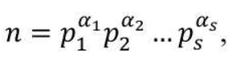

---
## Front matter
lang: ru-RU
title: Защита лабораторной 6
subtitle: по предмету мат. основы защиты информации
author:
  - Дидусь К.В.
institute:
  - Российский университет дружбы народов, Москва, Россия

## i18n babel
babel-lang: russian
babel-otherlangs: english

## Formatting pdf
toc: false
toc-title: Содержание
slide_level: 2
aspectratio: 169
section-titles: true
theme: metropolis
header-includes:
 - \metroset{progressbar=frametitle,sectionpage=progressbar,numbering=fraction}
 - '\makeatletter'
 - '\beamer@ignorenonframefalse'
 - '\makeatother'
---

# Информация

## Докладчик

:::::::::::::: {.columns align=center}
::: {.column width="70%"}

  * Дидусь Кирилл Валерьевич
  * Студент кафедры прикладной информатики и теории вероятностей
  * Российский университет дружбы народов
  * [1132223499@rudn.ru](mailto:1132223499@rudn.ru)
  * <https://github.com/kirilldi/>

:::
::: {.column width="30%"}

:::
::::::::::::::
# Введение

## Актуальность

- Изучение базовых принципов шифрования
- Важность знания основ шифрования для работы в сфере информационных технологий

## Цели и задачи лабораторной

Целью данной лабораторной работы является ознакомление с алгоритмом по разложению числа на множители.

## Материалы и методы

- ТУИС РУДН
- Язык программировния Python

## Разложение на множители

{width="60%"}

## Выполнение лабораторной

В ходе выполнения лабораторной работы было реализован алгоритм для разложения заданного числа на 2 нетривиальных сомножителя. Он реализует p-метод Полларда. 

 Программный код представлен в качестве листинга в конце отчета.

## Вывод

Таким образом, была достигнута цель, поставленная в начале лабораторной работы: я ознакомился с алгоритмом для разложения заданного числа на 2 нетривиальных сомножителя, а так же мне удалось реализовать его на языке программирования Python.
